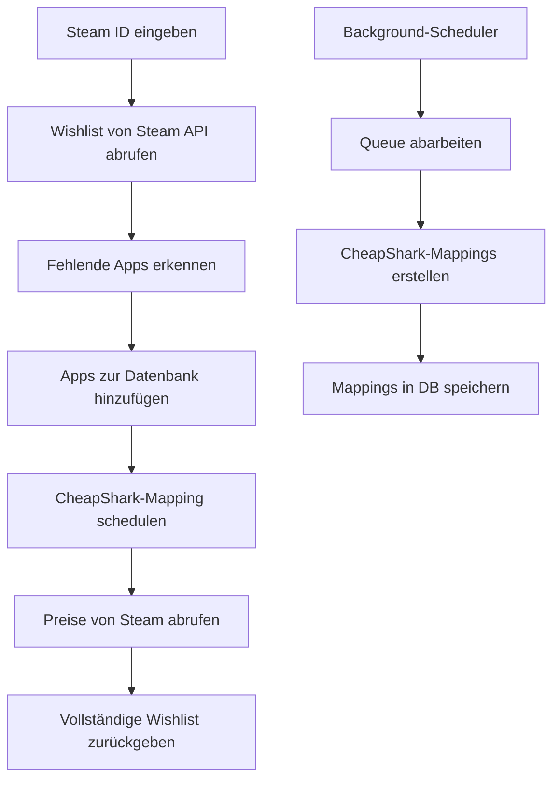

# 🎮 Steam Wishlist Manager v2.0

**Professioneller Steam Wishlist Manager mit automatischem CheapShark-Preisvergleich**

## ✨ Features

- 🚀 **Bulk Import** aller Steam-Spiele (100,000+ Apps in Minuten)
- 🎯 **Intelligentes Wishlist-Management** mit automatischer App-Erkennung
- 💰 **CheapShark-Integration** für Preisvergleiche und beste Deals
- ⚡ **Background-Scheduler** für kontinuierliches Mapping
- 🗄️ **SQLite-Datenbank** mit optimierten Abfragen
- 📊 **Umfassende Statistiken** und Reporting
- 🔧 **Modulare Architektur** für einfache Erweiterung
- 🖥️ **CLI & Interactive Mode** für verschiedene Nutzungsszenarien

## 📋 Inhalt

- [Schnellstart](#-schnellstart)
- [Installation](#-installation)
- [Konfiguration](#-konfiguration)
- [Nutzung](#-nutzung)
- [Architektur](#-architektur)
- [API-Dokumentation](#-api-dokumentation)
- [Troubleshooting](#-troubleshooting)
- [Contributing](#-contributing)

## 🚀 Schnellstart

### 1. Repository klonen & Setup

```bash
git clone <repository-url>
cd steam-wishlist-manager

# Automatisches Setup
python setup.py
```

### 2. Steam API Key konfigurieren

1. Gehe zu [Steam Web API Key](https://steamcommunity.com/dev/apikey)
2. Erstelle einen API Key
3. Trage ihn in die `.env`-Datei ein:

```env
STEAM_API_KEY=dein_api_key_hier
```

### 3. Erste Wishlist abrufen

```bash
# CLI-Modus
python setup.py wishlist 76561197960435530

# Oder Interactive Mode
python steam_wishlist_manager.py
```

## 📦 Installation

### Systemanforderungen

- **Python 3.8+**
- **Internet-Verbindung** für API-Zugriffe
- **~100MB freier Speicher** für Datenbank

### Automatische Installation

```bash
python setup.py setup
```

### Manuelle Installation

```bash
# Abhängigkeiten installieren
pip install -r requirements.txt

# .env-Datei erstellen
cp .env.example .env
# Steam API Key eintragen

# Datenbank initialisieren
python -c "from database_manager import DatabaseManager; DatabaseManager()"
```

## ⚙️ Konfiguration

### Umgebungsvariablen (.env)

```env
# Erforderlich
STEAM_API_KEY=dein_steam_api_key

# Optional
STEAM_WL_DB_PATH=steam_wishlist.db
STEAM_WL_DEFAULT_COUNTRY=DE
STEAM_WL_SCHEDULER_ENABLED=false
STEAM_WL_SCHEDULER_INTERVAL=10
STEAM_WL_RATE_LIMIT=0.5
CHEAPSHARK_RATE_LIMIT=1.5
```

### Konfigurationsdatei (config.json)

```json
{
  "database": {
    "path": "steam_wishlist.db",
    "backup_enabled": true,
    "cleanup_days": 30
  },
  "scheduler": {
    "enabled": false,
    "batch_size": 10,
    "interval_minutes": 10
  },
  "wishlist": {
    "default_country_code": "DE",
    "include_steam_prices_default": true,
    "include_cheapshark_default": true,
    "auto_schedule_mapping_default": true
  }
}
```

## 🎯 Nutzung

### Interactive Mode (Empfohlen für Anfänger)

```bash
python steam_wishlist_manager.py
```

**Hauptmenü:**
1. 🎯 Wishlist abrufen und verarbeiten
2. 📊 Manager-Status anzeigen  
3. 📥 Bulk Import durchführen
4. 🔗 CheapShark-Mapping verwalten
5. 🚀 Background-Scheduler starten/stoppen

### CLI-Mode (Für Automatisierung)

```bash
# Setup
python setup.py setup

# Wishlist abrufen
python setup.py wishlist 76561197960435530 --country DE --output wishlist.json

# Bulk Import
python setup.py bulk-import --method steam_store_service

# Scheduler verwalten
python setup.py scheduler start
python setup.py scheduler status
python setup.py scheduler stop

# Status anzeigen
python setup.py status

# Konfiguration anzeigen
python setup.py config show
```

### Programmatische Nutzung

```python
from steam_wishlist_manager import SteamWishlistManager

# Manager initialisieren
manager = SteamWishlistManager("dein_api_key")

# Wishlist verarbeiten
wishlist_data = manager.process_complete_wishlist(
    steam_id="76561197960435530",
    include_cheapshark=True,
    include_steam_prices=True,
    auto_schedule_mapping=True,
    country_code="DE"
)

# Ergebnisse anzeigen
manager.print_wishlist_summary(wishlist_data)

# Als JSON speichern
manager.save_wishlist_to_file(wishlist_data)
```

## 🏗️ Architektur

### Modulstruktur

```
steam-wishlist-manager/
├── 📁 Hauptmodule/
│   ├── steam_wishlist_manager.py    # Hauptmanager & Orchestrierung
│   ├── database_manager.py          # Zentrale Datenbankoperationen
│   ├── steam_bulk_importer.py       # Bulk Import aller Steam Apps
│   └── cheapshark_mapping_processor.py # CheapShark Mapping & Scheduler
├── 📁 Konfiguration/
│   ├── config.py                    # Zentrale Konfigurationsverwaltung
│   ├── config.json                  # Konfigurationsdatei
│   └── .env                         # Umgebungsvariablen
├── 📁 Setup & Tools/
│   ├── setup.py                     # Setup-Wizard & CLI
│   ├── requirements.txt             # Python-Abhängigkeiten
│   └── README.md                    # Diese Dokumentation
└── 📁 Output/
    ├── steam_wishlist.db            # SQLite-Datenbank
    └── wishlist_exports/            # JSON-Exporte
```

### Datenfluss



### Datenbank-Schema

**steam_apps** - Alle Steam-Anwendungen
- `app_id` (PRIMARY KEY)
- `name`, `type`, `is_free`
- `developer`, `publisher` 
- `price_current`, `price_original`, `discount_percent`
- `steam_data_updated`, `created_at`, `updated_at`

**cheapshark_mappings** - CheapShark-Zuordnungen
- `app_id` (FOREIGN KEY)
- `cheapshark_game_id`, `thumb_url`
- `cheapest_price_ever`, `cheapest_store`, `deals_count`
- `mapping_updated`, `mapping_attempts`, `last_attempt`

**wishlist_items** - Benutzer-Wishlists
- `steam_id`, `app_id` (Composite Key)
- `priority`, `date_added`, `wishlist_updated`

**mapping_queue** - CheapShark-Mapping Warteschlange
- `app_id`, `priority`, `status`
- `added_at`, `processing_started`, `completed_at`
- `error_message`, `retry_count`

## 📖 API-Dokumentation

### SteamWishlistManager

```python
class SteamWishlistManager:
    def __init__(self, api_key: str, db_path: str = "steam_wishlist.db")
    
    def process_complete_wishlist(self, 
                                steam_id: str,
                                include_cheapshark: bool = True,
                                include_steam_prices: bool = True, 
                                auto_schedule_mapping: bool = True,
                                country_code: str = "DE") -> Optional[Dict]
    
    def get_player_info(self, steam_id: str) -> Optional[Dict]
    def save_wishlist_to_file(self, wishlist_data: Dict, filename: str = None) -> str
    def print_wishlist_summary(self, wishlist_data: Dict)
    def get_manager_status(self) -> Dict
```

### DatabaseManager

```python
class DatabaseManager:
    def __init__(self, db_path: str = "steam_wishlist.db")
    
    # Apps
    def app_exists(self, app_id: str) -> bool
    def get_app(self, app_id: str) -> Optional[Dict]
    def add_app(self, app_data: Dict) -> bool
    def add_apps_batch(self, apps_data: List[Dict]) -> int
    
    # CheapShark
    def get_cheapshark_mapping(self, app_id: str) -> Optional[Dict]
    def add_cheapshark_mapping(self, mapping_data: Dict) -> bool
    
    # Wishlist
    def add_wishlist_items(self, steam_id: str, wishlist_data: List[Dict]) -> Tuple[int, int]
    def get_wishlist_items(self, steam_id: str, include_cheapshark: bool = True) -> List[Dict]
    
    # Statistics
    def get_database_stats(self) -> Dict
    def cleanup_old_data(self, days: int = 30)
```

### SteamBulkImporter

```python
class SteamBulkImporter:
    def __init__(self, api_key: str, db_manager: DatabaseManager = None)
    
    def import_all_steam_apps_method1(self) -> bool  # Steam API v2
    def import_games_only_method2(self) -> bool      # IStoreService
    def import_steamspy_data_method3(self, max_pages: int = 50) -> bool
    def full_import_recommended(self) -> bool
    def import_missing_apps_from_list(self, app_ids: list) -> int
```

### CheapSharkMappingProcessor

```python
class CheapSharkMappingProcessor:
    def __init__(self, api_key: str, db_manager: DatabaseManager = None)
    
    def process_single_app_mapping(self, app_id: str) -> bool
    def process_mapping_queue_batch(self, batch_size: int = 10) -> Dict
    def add_missing_apps_to_queue(self, app_ids: List[str], priority: int = 5) -> int
    def process_wishlist_apps_priority(self, steam_id: str) -> int
    
    # Scheduler
    def start_background_scheduler(self, batch_size: int = 10, interval_minutes: int = 10)
    def stop_background_scheduler(self)
    def get_scheduler_status(self) -> Dict
```

## 🔧 Troubleshooting

### Häufige Probleme

#### "❌ Kein API Key gefunden"
**Lösung:** 
1. Erstelle einen Steam Web API Key: https://steamcommunity.com/dev/apikey
2. Trage ihn in die `.env`-Datei ein: `STEAM_API_KEY=dein_key`

#### "❌ Ungültige Steam ID"
**Lösung:**
- Steam ID muss 17 Ziffern lang sein (Steam64 ID)
- Finde deine Steam ID: https://www.steamidfinder.com

#### "⚠️ Rate Limit erreicht"
**Lösung:**
- Erhöhe Rate Limits in `config.json`:
```json
{
  "steam_api": {"rate_limit_seconds": 1.0},
  "cheapshark": {"rate_limit_seconds": 2.0}
}
```

#### "❌ Datenbank-Fehler"
**Lösung:**
```bash
# Datenbank reparieren
python -c "from database_manager import DatabaseManager; dm = DatabaseManager(); dm.cleanup_old_data(1)"

# Oder neu erstellen (⚠️ Datenverlust!)
rm steam_wishlist.db
python -c "from database_manager import DatabaseManager; DatabaseManager()"
```

#### "📭 Wishlist ist leer"
**Ursachen:**
- Steam-Profil ist privat → Stelle es auf öffentlich
- Wishlist ist tatsächlich leer
- API-Schlüssel ungültig

### Performance-Optimierung

#### Große Datenbanken (>100k Apps)
```python
# Indizes prüfen
sqlite3 steam_wishlist.db "ANALYZE;"

# Vacuum für bessere Performance
sqlite3 steam_wishlist.db "VACUUM;"
```

#### Memory-Optimierung
```json
{
  "wishlist": {
    "cache_prices": false,  // Deaktiviert Preis-Cache
    "cache_expiry_hours": 1  // Kürzere Cache-Zeit
  }
}
```

#### Netzwerk-Optimierung
```json
{
  "steam_api": {
    "timeout_seconds": 30,  // Längerer Timeout
    "retry_attempts": 5     // Mehr Wiederholungen
  }
}
```

### Debug-Modus

```bash
# Verbose Logging aktivieren
export PYTHONPATH=.
python -c "
import logging
logging.basicConfig(level=logging.DEBUG)
from steam_wishlist_manager import SteamWishlistManager
# ... dein Code
"
```

## 🔄 Workflows

### Tägliche Nutzung
1. **Wishlist abrufen:** `python setup.py wishlist <steam_id>`
2. **Status prüfen:** `python setup.py status`
3. **Preise aktualisieren:** Automatisch via Scheduler

### Wöchentliche Wartung
1. **Neue Apps importieren:** `python setup.py bulk-import`
2. **CheapShark-Mappings:** Background-Scheduler macht das automatisch
3. **Datenbank bereinigen:** `python -c "from database_manager import DatabaseManager; DatabaseManager().cleanup_old_data()"`

### Einmalige Ersteinrichtung
1. **Setup:** `python setup.py setup`
2. **Bulk Import:** Alle Steam-Apps importieren
3. **Scheduler starten:** Für kontinuierliches Mapping
4. **Erste Wishlist:** Testen mit deiner Steam ID

## 📊 Performance & Limits

### Geschwindigkeiten
- **Bulk Import:** 100,000 Apps in 5-10 Minuten
- **Wishlist-Abruf:** 50-200 Apps in 10-30 Sekunden  
- **CheapShark-Mapping:** 20-40 Apps/Minute (API-begrenzt)

### API-Limits
- **Steam API:** ~120 Requests/Minute (2/Sekunde)
- **CheapShark API:** ~40 Requests/Minute (1/1.5 Sekunden)
- **Steam Store API:** ~60 Requests/Minute (1/Sekunde)

### Speicherbedarf
- **Minimale Installation:** ~10MB
- **Mit 100k Apps:** ~50-100MB
- **Mit allen Mappings:** ~200-500MB

## 🤝 Contributing

### Entwicklung

```bash
# Repository klonen
git clone <repository-url>
cd steam-wishlist-manager

# Development-Dependencies installieren
pip install -r requirements.txt
pip install pytest black flake8

# Code-Style prüfen
black --check .
flake8 .

# Tests ausführen
pytest tests/
```

### Neue Features

1. **Fork** das Repository
2. **Feature Branch** erstellen: `git checkout -b feature/amazing-feature`
3. **Änderungen committen:** `git commit -m 'Add amazing feature'`
4. **Branch pushen:** `git push origin feature/amazing-feature`
5. **Pull Request** erstellen

### Bug Reports

Bitte erstelle ein Issue mit:
- **Beschreibung** des Problems
- **Schritte zur Reproduktion**
- **Erwartetes vs. tatsächliches Verhalten**
- **System-Info:** OS, Python-Version, etc.
- **Logs:** Relevante Fehlermeldungen

## 📄 Lizenz

MIT License - siehe [LICENSE](LICENSE) für Details.

## 🙏 Danksagungen

- **Valve** für die Steam Web API
- **CheapShark** für die Preisvergleichs-API  
- **Python Community** für großartige Libraries
- **Contributors** für Verbesserungen und Bug-Fixes

---

## 📞 Support

- **GitHub Issues:** Für Bug-Reports und Feature-Requests
- **Discussions:** Für Fragen und Community-Support
- **Wiki:** Für erweiterte Dokumentation

**Viel Spaß beim Verwalten deiner Steam Wishlist! 🎮✨**